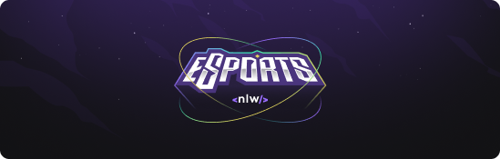
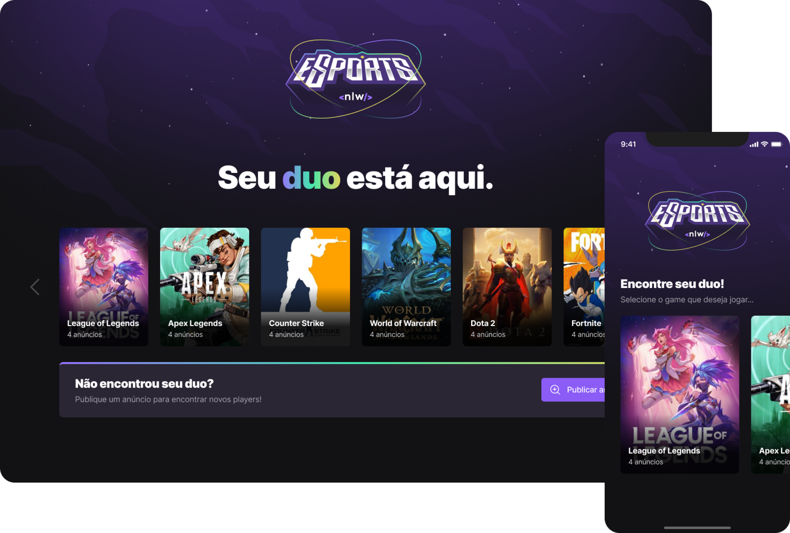

<div id="top"></div>

<div align="center">
   <a href="#">
       
  </a>
    <a href="#">
          
   </a>
   <a href="#">
       
   </a>
      <a href="#">
      
   </a>
   <a href="#">
       
   </a> 
   <a href="#">
      
   </a>
   <a href="https://www.linkedin.com/in/marcos-antonio-579370160/" target="_blank">
      
    </a>
</div>


<!-- PROJECT LOGO -->
<br />
<div align="center">
  <a href="#"> 
    
  </a>

  <h3 align="center">Come here and find your duo!</h3>  
</div> 

<!-- TABLE OF CONTENTS -->
<details>
  <summary>Table of Contents</summary>
  <ol>
    <li>
      <a href="#about-the-project">About The Project</a> 
    </li>
    <li><a href="#roadmap">Roadmap</a></li> 
    <li>
      <a href="#getting-started">Getting Started</a> 
    </li>  
    <li><a href="#built-with">Built With</a></li>
    <li><a href="#contact">Contact</a></li> 
    <li><a href="#license">Lisence</a></li> 
  </ol>
</details>


<!-- ABOUT THE PROJECT -->

## About The Project

<a href="#"
  
</a> 
<br> 
<br> 
Esports NLW is a project to practice some skills in a curse, building a Full Stack project with React, React Native, Tailwind and Prisma. Here you can create an ad to find your duo to play your favorite game 🎮
<br> 

<p align="right">(<a href="#top">back to top</a>)</p>


<!-- ROADMAP -->

## Roadmap

- [x] CRUD adds - Create, Update, Delete your ads  
- [x] CRUD Games - Create, Update, Delete games to list on the app  
- [x] Find games created


<p align="right">(<a href="#top">back to top</a>)</p>


<!-- GETTING STARTED -->

## Getting Started

### Installation and Running Locally
 
1. Clone the repo
   ```bash
   
   git clone https://github.com/Marcos-An/noemia.git
   
   ```
2. Open Server and Web folder then install node modules with yarn/npm packages
   ```bash
   
   yarn || npm install 
   
   ```
   
3. Run the Server and Web with yarn/npm packages
   ```bash
   
   yarn dev || npm run dev 
   
   ```  
   
4. Open mobile then install node modules with yarn/npm packages
   ```bash
   
   yarn || npm install 
   
   ```
   
5. Run the app on your device with yarn/npm packages
   ```bash
   
   yarn start || npm run start 
   
   ```  
   

<p align="right">(<a href="#top">back to top</a>)</p>
 
 
## Built with

-   [React](https://pt-br.reactjs.org/)
-   [React Native](https://reactnative.dev/) 
-   [TypeScript](https://www.typescriptlang.org/) 
-   [Node](https://nodejs.org/en/) 
-   [Prisma](https://www.prisma.io/) 

<!-- CONTACT -->

## Contact
<a href="https://www.linkedin.com/in/marcos-antonio-579370160/" target="_blank">
  
  <p>Marcos Silva</p>
</a>
<br /> 
<div >
     <a href="https://www.linkedin.com/in/marcos-antonio-579370160/" target="_blank">
      
    </a>
   <a href="mailto:marcos.silva.0556@gmail.com" target="_blank">
      
    </a>

</div> 

<!-- CONTACT -->

## License

Distributed under the MIT License. See <a href="https://github.com/Marcos-An/noemia/blob/main/LICENSE" target="_blank"> MIT </a> for more information.

<p align="right">(<a href="#top">back to top</a>)</p>


